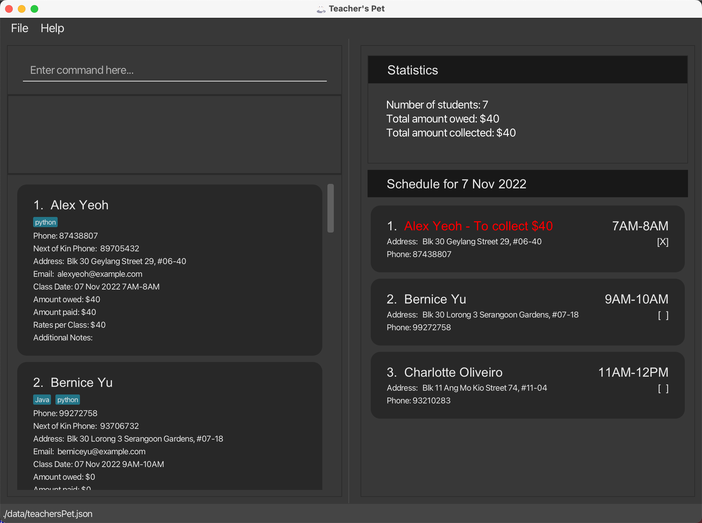

* This is **a project for Software Engineering (SE) students**. 
  Example usages:
    * as a starting point of a course project (as opposed to writing everything from scratch)
    * as a case study
* The project simulates an ongoing software project for a desktop application (called _AddressBook_) used for managing contact details.
    * It is **written in OOP fashion**. It provides a **reasonably well-written** code base **bigger** (around 6 KLoC) than what students usually write in beginner-level SE modules, without being overwhelmingly big.
    * It comes with a **reasonable level of user and developer documentation**.
* It is named `Teacher's Pet` (*tp* for short) because because it was designed to target the needs of teachers.
* For the detailed documentation of this project, see the **[Teacher's Pet Product Website](https://ay2223s1-cs2103t-t09-4.github.io/tp/)**.
* This project is a **part of the se-education.org** initiative. If you would like to contribute code to this project, see [se-education.org](https://se-education.org#https://se-education.org/#contributing) for more info.
* This project is based on the AddressBook-Level3 project created by the [SE-EDU initiative](https://se-education.org).
