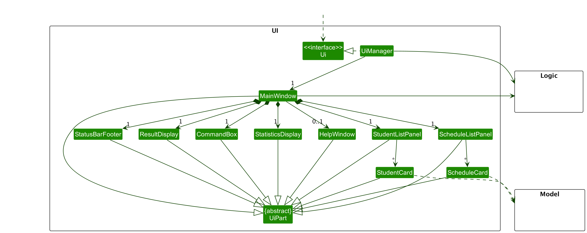
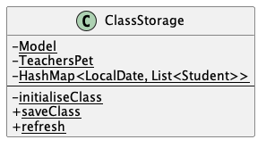
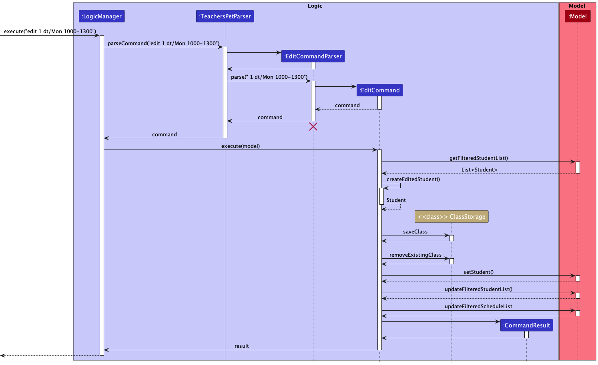
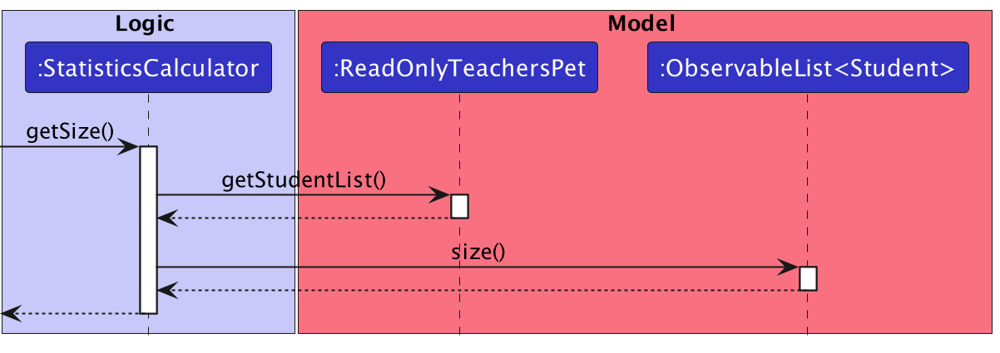
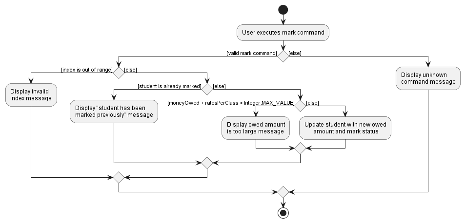
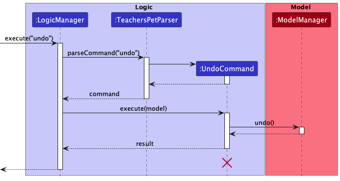
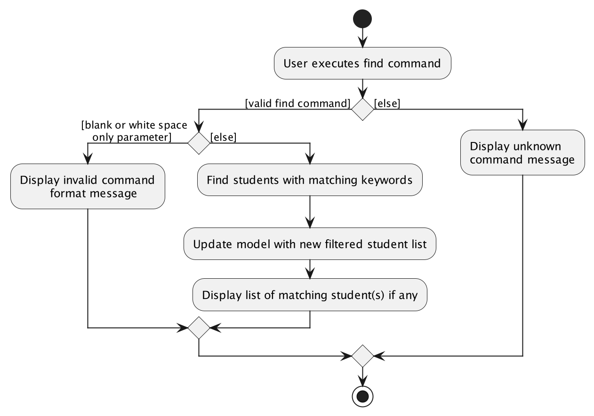
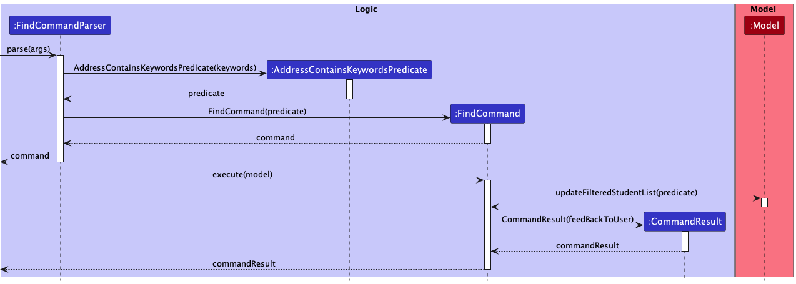
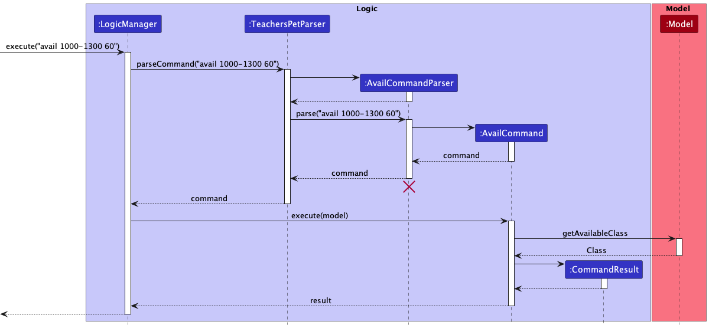
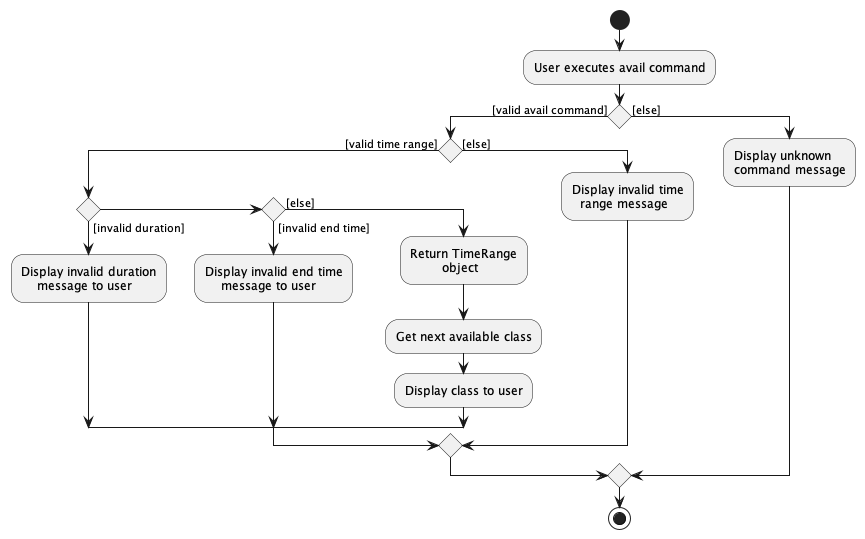

**Teacher’s Pet** is a desktop application that empowers private tutors to manage their students and schedule their classes.

This Developer Guide provides an in-depth documentation on how **Teacher’s Pet** is designed and implemented.
It covers the architecture of **Teacher’s Pet** and provides detailed descriptions regarding the implementation design.

You can use this guide to maintain, upgrade, and evolve **Teacher’s Pet**.

## Table of contents

* [Design](#design)
  * [Architecture](#architecture)
  * [UI](#ui-component)
  * [Logic](#logic-component)
  * [Model](#model-component)
  * [Storage](#storage-component)
* [Implementation](#implementation)
  * [Edit Class Feature](#edit-class-feature)
  * [Statistics Display Feature](#statistics-display-feature)
  * [Mark Student Feature](#mark-student-feature)
  * [Schedule List Feature](#schedule-list-feature)
  * [Sort-by](#sort-by-feature)
  * [Undo Command Feature](#undo-command-feature)
  * [Find by Feature](#find-by-feature)
  * [[Proposed] Next Available Class Feature](#proposed-next-available-class-feature)
* [Appendix](#appendix-requirements)
  * [Target User Profile](#target-user-profile)
  * [Value Proposition](#value-proposition)
  * [User Stories](#user-stories)
  * [Use Cases](#use-cases)
    * [Use case: **Delete a student**](#use-case-delete-a-student)
    * [Use case: **Edit a student's contact number**](#use-case-edit-a-students-contact-number)
    * [Use case: **Edit a student's class date**](#use-case-edit-a-students-class-date)
    * [Use case: **Find student by class date**](#use-case-find-student-by-class-date)
    * [Use case: **Find student by names**](#use-case-find-student-by-name)
    * [Use case: **Find student by address**](#use-case-find-student-by-address)
    * [Use case: **Mark student as present for class**](#use-case-mark-student-as-present-for-class)
    * [Use case: **Allocate a slot for future class**](#use-case-allocate-a-slot-for-future-class)
  * [Non-Functional Requirement](#non-functional-requirement)
  * [Glossary](#glossary)

--------------------------------------------------------------------------------------------------------------------
## Design

This section gives you a high-level overview of how **Teacher’s Pet** is structured and how the main components interact with one another.

### Architecture

The ***Architecture Diagram*** given above explains the high-level design of the App.

Given below is a quick overview of the main components and how they interact with each other.

**Main components of the architecture**

**`Main`** has two classes called [`Main`](https://github.com/AY2223S1-CS2103T-T09-4/tp/tree/master/src/main/java/seedu/address/Main.java) and [`MainApp`](https://github.com/se-edu/addressbook-level3/tree/master/src/main/java/seedu/address/MainApp.java). They are responsible for,
* At app launch: Initializing the components in the correct sequence, and connecting them up with each other.
* At shut down: Shutting down the components and invoking cleanup methods where necessary.

[**`Commons`**](#common-classes) represents a collection of classes used by multiple other components.

The rest of the App consists of four components.

* [**`UI`**](#ui-component): The UI of the App.
* [**`Logic`**](#logic-component): The command executor.
* [**`Model`**](#model-component): Holds the data of the App in memory.
* [**`Storage`**](#storage-component): Reads data from, and writes data to, the hard disk.

**How the architecture components interact with each other**

The *Sequence Diagram* below shows how the components interact with each other for the scenario where the user issues the command `delete 1`.

Each of the four main components (also shown in the diagram above),

* defines its *API* in an `interface` with the same name as the Component.
* implements its functionality using a concrete `{Component Name}Manager` class (which follows the corresponding API `interface` mentioned in the previous point).

For example, the `Logic` component defines its API in the `Logic.java` interface and implements its functionality using the `LogicManager.java` class which follows the `Logic` interface. Other components interact with a given component through its interface rather than the concrete class (reason: to prevent outside component's being coupled to the implementation of a component), as illustrated in the (partial) class diagram below.

The sections below give more details of each component.

### UI component

The **API** of this component is specified in [`Ui.java`](https://github.com/AY2223S1-CS2103T-T09-4/tp/tree/master/src/main/java/seedu/address/ui/Ui.java)

The UI consists of a `MainWindow` that is made up of parts e.g.`CommandBox`, `ResultDisplay`, `StudentListPanel`, `StatusBarFooter`, `StatisticsDisplay`, `ScheduleListPanel` etc. All these, including the `MainWindow`, inherit from the abstract `UiPart` class which captures the commonalities between classes that represent parts of the visible GUI.

The `UI` component uses the JavaFx UI framework. The layout of these UI parts are defined in matching `.fxml` files that are in the `src/main/resources/view` folder. For example, the layout of the [`MainWindow`](https://github.com/se-edu/addressbook-level3/tree/master/src/main/java/seedu/address/ui/MainWindow.java) is specified in [`MainWindow.fxml`](https://github.com/se-edu/addressbook-level3/tree/master/src/main/resources/view/MainWindow.fxml)

The `UI` component,

* executes user commands using the `Logic` component.
* listens for changes to `Model` data so that the UI can be updated with the modified data.
* keeps a reference to the `Logic` component, because the `UI` relies on the `Logic` to execute commands.
* depends on some classes in the `Model` component, as it displays `Student` object residing in the `Model`.

### Logic component

**API** : [`Logic.java`](https://github.com/AY2223S1-CS2103T-T09-4/tp/tree/master/src/main/java/seedu/address/logic/Logic.java)

Here's a (partial) class diagram of the `Logic` component:

How the `Logic` component works:
1. When `Logic` is called upon to execute a command, it uses the `TeachersPetParser` class to parse the user command.
2. This results in a `Command` object (more precisely, an object of one of its subclasses e.g., `AddCommand`) which is executed by the `LogicManager`.
3. The command can communicate with the `Model` when it is executed (e.g. to add a student).
4. The result of the command execution is encapsulated as a `CommandResult` object which is returned from `Logic`.

The Sequence Diagram below illustrates the interactions within the `Logic` component for the `execute("delete 1")` API call.

:information_source: **Note:** The lifeline for `DeleteCommandParser` should end at the destroy marker (X) but due to a limitation of PlantUML, the lifeline reaches the end of diagram.

Here are the other classes in `Logic` (omitted from the class diagram above) that are used for parsing a user command:

How the parsing works:
* When called upon to parse a user command, the `TeachersPetParser` class creates an `XYZCommandParser` (`XYZ` is a placeholder for the specific command name e.g., `AddCommandParser`) which uses the other classes shown above to parse the user command and create a `XYZCommand` object (e.g., `AddCommand`) which the `TeachersPetParser` returns back as a `Command` object.
* All `XYZCommandParser` classes (e.g., `AddCommandParser`, `DeleteCommandParser`, ...) inherit from the `Parser` interface so that they can be treated similarly where possible e.g, during testing.

### Model component
**API** : [`Model.java`](https://github.com/AY2223S1-CS2103T-T09-4/tp/tree/master/src/main/java/seedu/address/model/Model.java)

The `Model` component,

* stores the teacher's pet data i.e., all `Student` objects (which are contained in a `UniqueStudentList` object).
* stores the currently 'selected' `Student` objects (e.g., results of a search query) as a separate _filtered_ list which is exposed to outsiders as an unmodifiable `ObservableList<Student>` that can be 'observed' e.g. the UI can be bound to this list so that the UI automatically updates when the data in the list changes.
* stores a `UserPref` object that represents the user’s preferences. This is exposed to the outside as a `ReadOnlyUserPref` objects.
* does not depend on any of the other three components (as the `Model` represents data entities of the domain, they should make sense on their own without depending on other components)

:information_source: **Note:** An alternative (arguably, a more OOP) model is given below. It has a `Tag` list in the `TeachersPet`, which `Student` references. This allows `TeachersPet` to only require one `Tag` object per unique tag, instead of each `Student` needing their own `Tag` objects. 

### Storage component

**API** : [`Storage.java`](https://github.com/AY2223S1-CS2103T-T09-4/tp/tree/master/src/main/java/seedu/address/storage/Storage.java)

The `Storage` component,
* can save both teacher's pet data and user preference data in json format, and read them back into corresponding objects.
* inherits from both `TeachersPetStorage` and `UserPrefStorage`, which means it can be treated as either one (if only the functionality of only one is needed).
* depends on some classes in the `Model` component (because the `Storage` component's job is to save/retrieve objects that belong to the `Model`)

#### ClassStorage

The `ClassStorage` component,
* is a mini database, storing all the upcoming classes of the students in the form of a HashMap
* contains attributes such as
    1. `Model`
    2. `TeachersPet`
    3. `HashMap<LocalDate, List<Student>>`
       1. Maps a list of Student objects to a LocalDate object.
       2. Example: A list of all Students with classes on 19 April 2022 will
          be mapped to a LocalDate object (19 April 2022).
* contains main methods such as
    1. `initialiseClass`
       1. Initialises the HashMap when the application opens up
    2. `saveClass`
       1. Stores the new class and the student in the HashMap
    3. `refresh`:
       1. Re-initialises the HashMap in `ClassStorage`

### Common classes

Classes used by multiple components are in the `seedu.addressbook.commons` package.

--------------------------------------------------------------------------------------------------------------------
## Implementation

This section describes some noteworthy details on how certain features are implemented.
The features covered in this guide are:

* [Edit Class Feature](#edit-class-feature)
* [[Proposed] Next Available Class Feature](#proposed-next-available-class-feature)
* [Statistics Display Feature](#statistics-display-feature)
* [Mark Student Feature](#mark-student-feature)
* [Sort-by feature](#sort-by-feature)
* [Undo Command Feature](#undo-command-feature)
* [Find-by feature](#find-by-feature)

___

### Edit Class Feature

This feature allows the teacher to create a class at a specified date and time.

#### Implementation Details

The edit class mechanism is facilitated by ClassStorage. It stores the date of the classes as well as the students who attend them.

Additionally, it implements the following operations:

- `ClassStorage#saveClass()` — Saves the new class into its storage.

- `ClassStorage#removeExistingClass()` — Removes class from storage to free up the time slot.

- `ClassStorage#hasConflict()` — Checks if there is a conflict between the class timings.

The `EditCommandParser` reads the input and passes it to `ParserUtil` which returns an `Index`. If the given index is not a positive integer,
a `ParseException` will be thrown.
If the index is valid, `ParserUtil` will then check that both the date and time are valid before creating an `EditCommand`.

During the execution of `EditCommand`, if the given index is not within the range of the list, a `CommandException` will be thrown.
Otherwise, the model will then obtain the student using getFilteredStudentList.

Before assigning the class to the student, `ClassStorage` will check that there is no conflict between the timings of the new class
and the existing classes. `ClassStorage` will also check if the student has a pre-existing class. If yes, the pre-existing class
will be removed in order to free up the time slot. If there is no time conflict, `ClassStorage` will proceed to
save both the new class and student.

The following sequence diagram shows how the edit class operation works:

The following activity diagram summarizes what happens when a teacher executes an edit class command:

#### Design Considerations:
##### Aspect: Input format for edit class:

* **Alternative 1**: dt/yyyy-MM-dd 0000-2359
    * Pros: Easy to implement.
    * Cons: The teacher has to fully match the date format and order, which is much more cumbersome.

* **Alternative 2**: dt/Day-of-Week 0000-2359 (case-insensitive)
    * Pros: More convenient and easier for the teacher to type.
    * Cons:
        1. Harder to implement.
        2. Only can set the class to a date at most 1 week away.

___

### Statistics Display Feature

This feature allows the teacher to get an overall view of his/her teaching statistics, which includes the number of students, total money owed and total money paid by the current list of students.

#### Implementation Details

`MainWindow.fxml` is modified to update the `UI` from the original single-panel view to include an additional top right statistics panel.
The calculation of the statistics is facilitated by `StatisticsCalculator`, which stores `ReadOnlyTeachersPet` internally that keeps track of the list of students.

Additionally, it implements the following operations:
- `StatisticsCalculator#getSize()` — Gets the current number of students in the list.
- `StatisticsCalculator#getAmountOwed()` — Calculates the total amount owed by students in the list.
- `StatisticsCalculator#getAmountPaid()` — Calculates the total amount paid by students in the list.

When a user command gets executed, the 3 operations are performed once to display the updated statistics.

How the individual operations work:
- `StatisticsCalculator#getSize()`
  1. When `StatisticsCalculator#getSize()` is called by `StatisticDisplay`, `StatisticsCalculator` attains the updated list of students from `ReadOnlyTeachersPet`.
  2. After getting the list of students in the form of `ObservableList<Student>`, StatisticsCalculator returns the `size` of the `ObservableList<Student>`.
  
  

- `StatisticsCalculator#getAmountOwed()`
  1. When `StatisticsCalculator#getAmountOwed()` is called by `StatisticDisplay`, `StatisticsCalculator` attains the updated list of students from `ReadOnlyTeachersPet`.
  2. After getting the list of students in the form of `ObservableList<Student>`, `StatisticsCalculator` iterates across all students in the list and sums the total amount owed.

- `StatisticsCalculator#getAmountPaid()`
  1. When `StatisticsCalculator#getAmountPaid()` is called by `StatisticDisplay`, `StatisticsCalculator` attains the updated list of students from `ReadOnlyTeachersPet`.
  2. After getting the list of students in the form of `ObservableList<Student>`, `StatisticsCalculator` iterates across all students in the list and sums the total amount paid.

#### Design Considerations:
##### Aspect: Implementing the statistics function:

* **Alternative 1 (current choice)**: Call three different statistics functions (getSize(), getAmountOwed(), getAmountPaid()) 
    * Pros: Each function obeys Single Responsibility Principle (SRP).
    * Cons: More code must be typed.

* **Alternative 2**: Call a single statistics function which returns an array of statistical values
    * Pros: 
        1. Fewer repetition of code.
        2. More optimised solution as `ObservableList<Student>` needs to be iterated only once. 
    * Cons: Violates Single Responsibility Principle (SRP) as the function would have multiple responsibilities.

___

### Schedule List Feature
This feature allows the user to be able to view a schedule on the right hand side of the panel.

#### Implementation Details
`MainWindow.fxml` is modified to update the UI from the original single-panel view to include an additional right panel.

Since there is a need for the schedule list to be a constant panel, which is separate from the `StudentListPanel`,
a `ScheduleListPanel` under `UI` had to be created along with a `ScheduleListCard` class also under `UI`. The
`ScheduleListCard` will contain a selective set of information related to a schedule compared to `StudentCard`. 

Correspondingly, `StudentListCard.fxml` and `StudentListPanel.fxml` had to be created too.

Since the `UI` depends on the `Model`, there was a need to update the model to now include a `UniqueScheduleList`.
This `UniqueScheduleList` would store the filtered version of the original `AddressBook`, based on the current date.

#### Design Considerations
#### Aspect: Determining how to design ScheduleList:
* Alternative 1: Reusing `UniqueStudentList` to store the `ScheduleList` under `AddressBook`
  * Pros: Minimise code duplication since class is reused
  * Cons: UniqueStudentList insufficient in design to support the needs of holding untouched state and filtered state
* Alternative 2: Creating a dedicated `UniqueScheduleList` 
  * Pros: Achieved our purpose of a `ScheduleList`
  * Cons: Code duplication

___

### Mark Student Feature

This feature allows the teacher to mark a student as present for class, which increases the student's amount owed by the rates per class.

#### Implementation Details

This command executes 3 main actions, they are:
1. Display a cross beside the student's name in the Schedule list.
   - `ScheduleCard.java` contains a `Label` called `markStatus` to display the cross if the student is marked.
   - `ScheduleCard#setMarkStatus(Student student)` sets the text of `markStatus` to be `[X]` if the `student` is marked, else `[ ]`.

2. Increment the money owed by the student.
   - This action will add `ratesPerClass` field to `moneyOwed` field in `Student`.
   - The addition of money is called through `Money#addTo(Money money)` method.
   - To prevent integer overflow from happening, `Money#addTo(Money money)` throws a `CommandException` if it occurs.

The following diagram illustrates how the operation works:

---

### Sort-by feature

This feature allows the user(teacher) to sort the students from Teacher's Pet by specified `TYPE` and `ORDER`.
`ORDER` is optional and by default, it will be set to `ASC` for `NAME` and `CLASS` sort, and `DESC` for `OWED` sort, unless otherwise specified.

#### Implementation Details

The `sort` mechanism is facilitated within [TeachersPet.java](https://github.com/AY2223S1-CS2103T-T09-4/tp/tree/master/src/main/java/seedu/address/model/TeachersPet.java).
The `SortCommand` object will be creating a comparator based on the argument received and pass it to `TeachersPet` so that it will return the
list of students as per usual. Additionally, it implements the following operation:
- `TeachersPet#SortStudents(ComparatorM<Student>)` -- Updates the `students` by sorting the list with the given `Comparator`.

The following diagram illustrates how the operation works:

:information_source: **Note:** The lifeline for `SortByCommand` should end at the destroy marker (X) but due to a limitation of PlantUML, the lifeline reaches the end of diagram.

---

### Undo command feature

#### Implementation Details

The undo mechanism is facilitated by `teachersPetHistory` within [ModelManager.java](https://github.com/AY2223S1-CS2103T-T09-4/tp/tree/master/src/main/java/seedu/address/model/ModelManager.java). Additionally, it implements the following operations:

* `ModelManager#updateTeachersPeyHistory()` — Saves the current teacher's pet state in its history.
* `ModelManager#undo()` — Restores the previous teacher's pet state from its history.
* `ModelManager#deleteTeachersPetHistory()` — Removes the latest teacher's pet state from its history.

These operations are exposed in the `Model` interface as `Model#updateTeachersPeyHistory()`, `Model#undo()` and `Model#deleteTeachersPetHistory()` respectively.

The following sequence diagram shows how the undo operation works:

:information_source: **Note:** The lifeline for `UndoCommand` should end at the destroy marker (X) but due to a limitation of PlantUML, the lifeline reaches the end of diagram.

#### Design considerations:

**Aspect: How undo executes:**

* **Alternative 1 (current choice):** Saves the entire teacher's pet.
    * Pros: Easy to implement.
    * Cons: May have performance issues in terms of memory usage.

* **Alternative 2:** Individual command knows how to undo by
  itself.
    * Pros: Will use less memory (e.g. for `delete`, just save the student being deleted).
    * Cons: We must ensure that the implementation of each individual command are correct.

---

### Find-by feature

This feature allows the user (teacher) to find a list of students from Teacher's Pet by one of the specified keywords.

#### Implementation Details

The `find` mechanism is facilitated within [TeachersPet.java](https://github.com/AY2223S1-CS2103T-T09-4/tp/tree/master/src/main/java/seedu/address/model/TeachersPet.java).
There are 7 different variations of `find`:
1. Find by name: Find all matching student(s) with any matching full keyword(s) from name of student using `find n/[KEYWORDS]`.
2. Find by email: Find all matching student(s) with any matching full keyword(s) from email of student using `find e/[KEYWORDS]`.
3. Find by address: Find all matching student(s) with any matching keyword(s) from address of using `find a/[KEYWORDS]`.
4. Find by student's contact number: Find the matching student with a particular contact number using `find p/CONTACT_NUMBER`.
5. Find by next of kin's contact number: Find all matching student(s) with a particular next of kin's contact number using `find np/NEXT_OF_KIN_CONTACT_NUMBER`.
6. Find by class date: Find all matching student(s) with classes on a particular date`find dt/[CLASS_DATE]`.
7. Find by tag: Find all matching student(s) with exact matching full keyword(s) from tag(s) of student using `find t/[TAG]`.

:information_source: **Note:** The 7 variations cannot be mixed with one another.

The following activity diagram summarizes what happens when a user executes a find command:

Below is an example of the general flow of a find by address command.

##### Find by address
1. `FindCommandParser` will parse the keywords to `AddressContainsKeywordsPredicate`.
2. `AddressContainsKeywordsPredicate` will be generated and a predicate value will be returned to `FindCommandParser`.
3. `FindCommandParser` will send the predicate value to `FindCommand`.
4. `FindCommand` will be generated and the command will be returned to the `FindCommandParser`.
5. `FindCommand` will call the `execute(model)` function, and pass the predicate value into `Model` through `updateFilteredStudentList`.
6. `filteredStudents` list will be updated accordingly in `ModelManager` and the list display in Teacher's Pet will be updated.
7. `CommandResult` will eventually be returned and feedback will be given to the user.

The following sequence diagram summarizes what happens when a user executes a find by address command:

___

### [Proposed] Next Available Class Feature

This feature allows the teacher to find the next available class by specifying the time range and the duration that
he or she is looking at. For example, if the teacher wants to have a 1-hour class in the range of 1000-1600, but is not
sure when is the next available date, he or she can simply run `avail 1000-1600 60` and the first available class would
be output to the teacher.

#### Proposed Implementation

The main logic of the available class resides in `UniqueStudentlist::getAvailableClass`, where it takes a given
`TimeRange` parameter and outputs the next available class.

The `TimeRange` class stores the `startTimeRange`, `endTimeRange` and `duration` (in minutes).

The `AvailCommandParser` reads the input and passes it to `ParserUtil` which returns a `TimeRange` object. If the
duration provided is not valid or if the endTime is not valid, a `ParseException` will be thrown. If there are no
exceptions being thrown, `AvailCommandParser` will create an `AvailCommand`.

During the execution of `AvailCommand`, a call will be made to `Model` in order to get the available class. `Model`
will then call `TeachersPet::getAvailableClass`. The `TeachersPet::getAvailableClass` will then call
`UniqueStudentList::getAvailableClass` which will subsequently return a `Class` object, which will be displayed to
the user.

The following sequence diagram shows how the avail operation works:

The following activity diagram summarizes what happens when a teacher executes an avail class command:

#### Design Considerations:
##### Aspect: Input format for avail class:

* **Alternative 1**: avail
    * Pros: Easy to implement.
    * Cons: It will be hard coded to find the next available class of a one-hour slot. Inflexible.

* **Alternative 2**: avail 0000-2359 0 (in minutes)
    * Pros: More flexible, allowing teacher to specify what the time range is and the duration of class interested in.
    * Cons: Harder to implement.

___

## Appendix: Requirements

### Target User Profile

- a private teacher who teaches 1-1 classes and needs to manage the students’ details
- prefer desktop apps over other types
- can type fast
- prefers typing to mouse interactions
- is reasonably comfortable using CLI apps

### Value Proposition

Manage contacts and schedule of students faster than a typical mouse/GUI driven app

### User Stories

| S/N | As a/an ...                                                                    | I can ...                                                                           | So that...                                                              | Priority   |
|-----|--------------------------------------------------------------------------------|-------------------------------------------------------------------------------------|-------------------------------------------------------------------------|------------|
| 1   | Teacher who prefers flexibility                                                | Reschedule my class                                                                 | I can allow the students to more flexibility when arranging for a class | HIGH       |
| 2   | Meticulous teacher                                                             | Add teaching notes                                                                  | I can record any additional information about the student               | HIGH       |
| 3   | Organised teacher                                                              | View the students I have in the day                                                 | I know what to expect in the day                                        | HIGH       |
| 4   | Teacher                                                                        | Edit the students' contact details                                                  | I am able to contact the student or next-of-kin whenever necessary      | HIGH       |
| 5   | Teacher with forgetful students                                                | Check how much a single student owes me                                             | I can remind the student to pay me                                      | HIGH       |
| 6   | New app user                                                                   | See which commands are available for me to use                                      | I know how to use the application                                       | HIGH       |
| 7   | Teacher who has many students                                                  | Check the students’ phone number                                                    | I can contact them                                                      | HIGH       |
| 8   | Forgetful teacher                                                              | Check the students' address                                                         | I know where I should go to for class                                   | HIGH       |
| 9   | Teacher who likes a clear overview                                             | View a list of all students                                                         | I have a clear view of all students                                     | HIGH       |
| 10  | Teacher who likes to minimise the number of applications opened on his desktop | Have a way to close the application                                                 | I can exit the application                                              | HIGH       |
| 11  | Teacher with many students                                                     | Check the students’ next of kin’s contact number                                    | I can contact the parents or guardian under certain circumstances       | HIGH       |
| 12  | Teacher who likes to have a clear picture                                      | Have a better UI to view the schedule and the tasks                                 | I can view everything in one page                                       | HIGH       |
| 13  | Careless teacher                                                               | Receive an echo of my command                                                       | I know that I have typed the information correctly                      | MEDIUM     |
| 14  | Inexperienced teacher at coding                                                | Be warned if I’ve added an existing student to the student list                     | I do not have any duplicated students                                   | MEDIUM     |
| 15  | Teacher                                                                        | Be warned if a student owes me money                                                | I know who to collect money from in the day                             | MEDIUM     |
| 16  | Forgetful teacher                                                              | Be warned if the addition of a new session will clash with a previously set session | I can have a peace of mind that my students’ sessions do not clash      | MEDIUM     |
| 17  | Busy teacher                                                                   | Sort my students based on the class timing                                          | I know when is my next class                                            | MEDIUM     |
| 18  | Teacher                                                                        | Find all students who have classes on a particular date                             | I know which students I have on a specific day                          | MEDIUM     |
| 19  | Teacher                                                                        | Edit a student's unpaid amount                                                      | I can update how much money a student owes                              | MEDIUM     |
| 20  | Lazy teacher                                                                   | Find multiple students by their name                                                | I can find multiple students quickly                                    | MEDIUM     |
| 21  | Lazy teacher                                                                   | Delete multiple students at once                                                    | I can delete multiple students quickly                                  | MEDIUM     |
| 22  | Teacher                                                                        | Find a student by phone number                                                      | I know which student is calling me                                      | MEDIUM     |
| 23  | Careless teacher                                                               | Undo my action                                                                      | I can reverse a mistake done                                            | MEDIUM     |
| 24  | Teacher who wants to do things quick                                           | Delete all students at once                                                         | I can clear my entire data record at once                               | MEDIUM/LOW |
| 25  | Teacher                                                                        | Find the next available time slot                                                   | I do not have to check for clashes each time I schedule the next class  | LOW        |
| 26  | Busy teacher                                                                   | Sort my students based on alphabetical order                                        | I can find the details of my students quicker                           | LOW        |
| 27  | Poor teacher                                                                   | Sort my students based on the amount of money owed                                  | I know who owes the most amount of money so that I can ask for payment  | LOW        |
| 28  | Busy teacher                                                                   | Add the date of the next class in a more natural format (e.g., Tue)                 | I do not need to search for the date manually                           | LOW        |
| 29  | Forgetful teacher                                                              | See tags by students                                                                | I can see necessary info such as #python                                | LOW        |
| 30  | Teacher who loves money                                                        | Check the total money paid by all students                                          | I can check the total amount I have earned                              | LOW        |

### Use Cases

(For all use cases below, the **System** is the `Teacher's Pet` and the **Actor** is the `teacher`, unless specified otherwise)

#### Use case: **Delete a student**

**MSS**

1. Teacher requests to list students.
2. Teacher’s Pet shows a list of students.
3. Teacher requests to delete a specific student in the list.
4. Teacher’s Pet deletes the student.

   Use case ends.

**Extensions**

- 2a. The list is empty.

  Use case ends.

- 3a. The given index is invalid.
    - 3a1. Teacher’s Pet shows an error message.

      Use case resumes at step 2.

#### Use case: **Edit a student's contact number**

**MSS**

1. Teacher requests to list students.
2. Teacher’s Pet shows a list of students.
3. Teacher requests to edit contact number of a specific student in the list.
4. Teacher’s Pet updates the student with the new contact number.

   Use case ends.

**Extensions**

- 1a. The given index is invalid.
    - 1a1. Teacher’s Pet shows an error message.

  Use case ends.

- 1b. The given contact number is invalid.
    - 1b1. Teacher’s Pet shows an error message.

  Use case ends.

#### Use case: **Edit a student's class date**

**MSS**

1. Teacher requests to list students.
2. Teacher’s Pet shows a list of students.
3. Teacher requests to edit class date of a specific student in the list.
4. Teacher’s Pet updates the student with the new class date.

   Use case ends.

**Extensions**

- 1a. The given class date is in invalid date format.
    - 1a1. Teacher’s Pet shows an error message.

  Use case ends.

- 1b. The given class date is occupied by another student.
    - 1b1. Teacher’s Pet shows an error message.

  Use case ends.

#### Use case: **Find student by class date**

**MSS**

1. Teacher requests to find all the students with classes on a particular date.
2. Teacher’s Pet shows a list of all the students with their details.

   Use case ends.

**Extensions**

- 1a. None of the students has classes on that date.
    - 1a1. Teacher’s Pet shows no students listed.

      Use case ends.

#### Use case: **Find student by name**

**MSS**

1. Teacher requests to find all the students with names matching the keywords.
2. Teacher’s Pet shows a list of filtered students according to their provided query.

   Use case ends.

**Extensions**

- 1b. Multiple students share the same name in the system.
    - 1b1. Teacher’s Pet lists the details of multiple students.

      Use case ends.

#### Use case: **Find student by address**

**MSS**

1. Teacher requests to find all the students with address matching the keywords.
2. Teacher’s Pet shows a list of filtered students according to their provided query.

   Use case ends.

**Extensions**

- 1a. Teacher requests to find by address with a blank or white space as the only parameter.
    - 1a1. Teacher’s Pet displays invalid address format command message.

      Use case ends.

- 1b. Teacher's Pet detects multiple students share the same address in the system.
    - 1b1. Teacher’s Pet lists the details of all those students.

      Use case ends.

#### Use case: **Mark student as present for class**

**MSS**

1. Teacher requests to mark a specific student in the list as present for class.
2. Teacher’s Pet marks the student as present for class.
3. A cross will be displayed beside the student on the schedule list panel.

    Use case ends.

**Extensions**

* 2a. The list is empty.

  Use case ends.

* 3a. The given index is invalid.

    - 3a1. Teacher’s Pet shows an error message.

        Use case resumes at step 2.

* 3b. The student’s attendance is already marked as present.

    - 3b1. Teacher’s Pet shows a message indicating student’s attendance is already marked as present.

        Use case resumes at step 2.

#### Use case: **Allocate a slot for future class**

**MSS**

1. Teacher requests to find the next available slot for class.
2. Teacher discusses with the student about whether the proposed slot is possible.
3. Teacher [edits](#use-case-edit-a-students-class-date) the student record with the next class date.

**Extensions**

- 2a. The student cannot make it on the proposed slot.
  - Step 1-2 is repeated until a mutually-agreed slot is found.

    Use case resumes at step 3.

### Non-Functional Requirement

1. Should work on any *mainstream OS* as long as it has Java`11` or above installed.
2. Should be able to hold up to 50 students without a noticeable sluggishness in performance for typical usage.
3. A user with above average typing speed for regular English text _(i.e. not code, not system admin commands)_ should
   be able to accomplish most of the tasks faster using commands than using the mouse.
4. If the user wants to complete something, he can do it within 3 commands maximum.
5. The application can store the changed user data after the application has been closed and load from memory when it is
   opened.
6. The UI page should load when first launched within 2 seconds.
7. The application can work without Internet connection.

### Glossary

| Terms         | Definition                                                                                              |
|---------------|---------------------------------------------------------------------------------------------------------|
| Mainstream OS | Windows, Linux, Unix, OS-X                                                                              |
| CLI           | Command Line Interface                                                                                  |
| Class         | The 1-1 tutoring time slot of a student                                                                 |
| Day-of-Week   | 3-letter Abbreviation; case-insensitive e.g., Mon, MON                                                  |
| Use case      | It describes an interaction between the user and the system for a specific functionality of the system. |

Note:
- Command Line Interface: Text based user interface for the user to interact with, by passing in single line commands.
