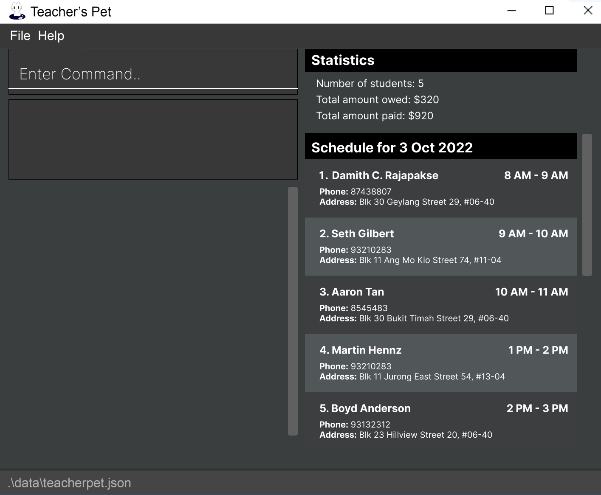
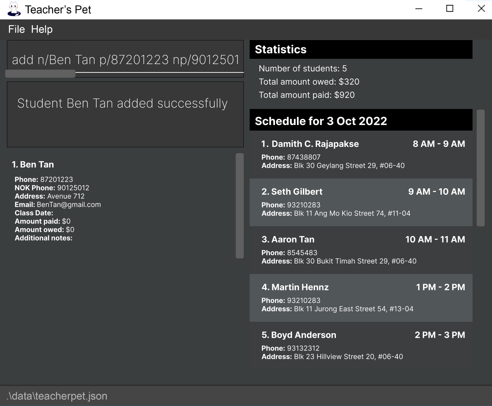
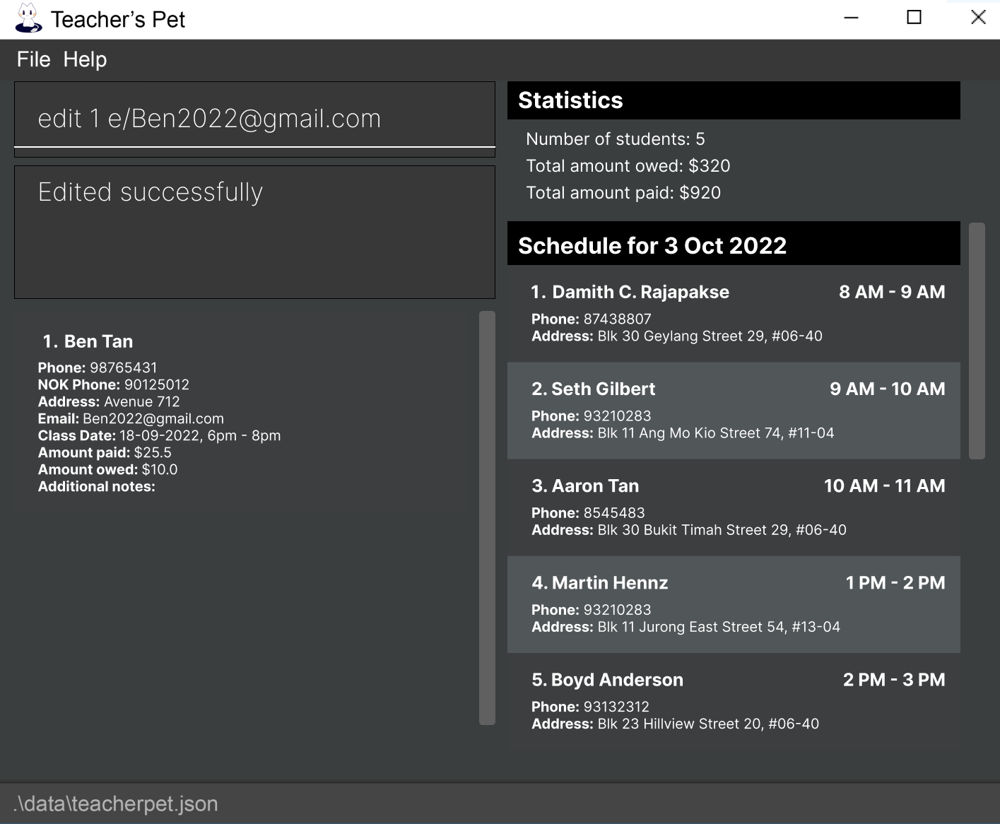

# Teacher's Pet User Guide (v1.2)

Teacher’s Pet is a desktop application for managing contacts of students and classes, optimised for use via a
Command Line Interface (CLI) while still having the benefits of a Graphical User Interface (GUI). If you can type fast,
Teacher’s Pet can get your contact and class management tasks done faster than traditional GUI apps.

---

## Quick start

1. Ensure you have Java `11` or above installed in your Computer.
2. Download the latest `teacherpet.jar` from …
3. Copy the file to the folder you want to use as the *home folder* for your application.
4. Double-click the file to start the app. The GUI similar to the below should appear in a few seconds.
   Note how the app contains some sample data.




### UI Overview


Our application is divided into 5 areas to maximise productivity, the specific uses are:

- Input Command - The dialog box where all user interaction are held
- Application’s Reply - A short answer whether the application has executed the command, or an error message if the
  application did not understand the command
- Student's Details - A window that will display the details of the student(s)
- Statistics Window - A window that shows all the statistics of the tutor, such as the number of students and
the money collected/owed
- Day’s Schedule List - A scroll window which shows the schedule for the day, sorted by time

1. Type the command in the command box and press Enter to execute it. e.g. typing `help` and pressing Enter will open
   the help window. Some example commands you can try:
    - `list`: Lists all contacts.
    - `add n/John Doe p/98765432 e/johnd@example.com a/John street, block 123, #01-01`: Adds a contact named
      `John Doe` to the Address Book.
    - `delete 3`: Deletes the 3rd contact shown in the current list.
    - `clear`: Deletes all contacts.
    - `exit`: Exits the app.
2. Refer to the Features below for details of each command.

---

## Features

**Notes about the command format:**

- Words in `UPPER_CASE` are the parameters to be supplied by the user. e.g. in `add n/NAME`, `NAME` is a parameter
  which can be used as `add n/John Doe`.
- Items in square brackets are optional. e.g `n/NAME [t/TAG]` can be used as `n/John Doe t/friend` or as `n/John Doe`.
- Items with `…` after them can be used multiple times including zero times. e.g. `[t/TAG]…` can be used as ` ` (i.e.
  0 times), `t/friend`, `t/friend t/family` etc.
- Parameters can be in any order. e.g. if the command specifies `n/NAME p/PHONE_NUMBER`, `p/PHONE_NUMBER n/NAME`
  is also acceptable.
- If a parameter is expected only once in the command, but you specified it multiple times, only the last occurrence
  of the parameter will be taken. e.g. if you specify `p/12341234 p/56785678`, only `p/56785678` will be taken.
- Extraneous parameters for commands that do not take in parameters (such as `help`, `list`, `exit` and `clear`) will
  be ignored. e.g. if the command specifies `help 123`, it will be interpreted as `help`.

### Viewing help : `help`

Shows a message explaining how to access the help page.

Format: `help`

Example: `help`


---

[](#adding-a-studentadd)
### Adding a student: `add`

Adds a student to the Teacher’s Pet.

1. Student’s Name
    - Student’s Name must not be empty
    - Student’s Name must only contain alphabetical letters.
```yaml
Note: Duplicates students are not allowed!
```

2. Student’s Contact Number
   - Contact number must only contain numerical digits between `0` and `9`
   - White spaces between numbers will be automatically removed. eg: `8123 4556` will be converted to `81234567`
   - Number must have 8 digits and starts with either ‘8’ or ‘9’
```yaml
Note: Contact number cannot be empty. It must contain at least 1 digit.
```

3. Next of Kin’s Number
    - Next of Kin’s Number must only contain numerical digits between `0` and `9`
    - Next of Kin’s Number must have 8 digits and starts with either ‘8’ or ‘9’
    - White spaces between numbers will be automatically removed. eg: `8123 4556` will be converted to `81234567`
```yaml
Note: Next of Kin’s number cannot be empty. It must contain at least 1 digit.
```

4. Address
    - Address must not be empty
    - Address may contain any kinds of character

```yaml
Note: Address cannot be empty. It must contain at least 1 character.
```

5. Email
    - Email may contain any kinds of `character`, other than white space ` `
    - Email must contain a `@`

```yaml
Note: Email cannot be empty. It must contain at least 1 character.
```

6. Class Date
    - Class Date must be in the format YYYY-MM-DD {start time}-{end time}

```yaml
Note: Start time and End time must be in 24hour format.
```

Format: `add n/NAME p/CONTACT_NUMBER np/NEXT_OF_KIN_CONTACT_NUMBER a/ADDRESS e/EMAIL dt/CLASS_DATE`

Example:

- `add n/Ben Tan p/87201223 np/90125012 a/Avenue 712 e/BenTan@gmail.com dt/2022-04-19 1500-1600`



```yaml
Note: Amount paid, Amount owed, Additional notes fields are to be updated via `edit` command.
```

---

### Edit student details: `edit`

Edits an existing student in the list.

- Student’s Name
- Phone number
- Next of Kin’s phone number
- Address
- Class Date
- Amount paid
- Amount owed
- Additional notes

1. Student's Name, Phone number, Next of Kin’s phone number, Email, Address, and Class Date follow the same convention as in Adding a student:
    [`add` section](#adding-a-studentadd)
2. Amount paid
    - Amount paid can be an integer or a double.
    - Amount paid must be non negative.
3. Amount owed
    - Amount owed can be an integer or a double.
    - Amount owed must be non negative.
    - Amount owed and Amount paid are modified independent of each other.
4. Additional notes
    - Additional notes is a String and can be empty.

```yaml
Important:
- note **at least one** of these fields must exist in order to make the
  `edit` command valid.
```

Format: `edit INDEX [n/NAME] [p/CONTACT_NUMBER] [np/NEXT_OF_KIN_CONTACT_NUMBER] [e/EMAIL] [dt/CLASS_DATE] [a/ADDRESS] 
[paid/AMOUNT_PAID] [owed/AMOUNT_OWED] [nt/ADDITIONAL_NOTES]`

Example:

- `edit 1 e/Ben2022@gmail.com`



---
### View all students: `list`

Allows the user to view students and their information which includes:

- Phone number
- Next of Kin’s number
- Address
- Email
- Class Date
- Amount paid
- Amount owed
- Additional notes

Format: `list`


---
### Exiting the program : `exit`

Exits the program.

Format: `exit`

### Saving the data

Teacher’s Pet data are saved in the hard disk automatically after any command that changes the data. There is no need to save manually.

### Editing the data file

Students' data is saved as a JSON file `[JAR file location]/data/addressbook.json`. Advanced users are welcome to edit the data file.

```yaml
❗ Caution: If your changes to the data file makes its format invalid, Teacher’s Pet will discard all data and start with an empty data file at the next run.
```

---

## FAQ

Q: How do I transfer my data to another Computer?

A: Install the app in the other computer and overwrite the empty data file it creates with the file that contains the data of your previous AddressBook home folder.

---

## Command summary

| Action               | Format, Examples                                                                                                                                                                                   |
|----------------------|----------------------------------------------------------------------------------------------------------------------------------------------------------------------------------------------------|
| Add a student        | add n/NAME p/CONTACT_NUMBER np/NEXT_OF_KIN_CONTACT_NUMBER a/ADDRESS e/EMAIL dt/CLASS_DATE `e.g., add n/John Doe p/98765432 np/90123291 a/Street ABC e/johnd@example.com dt/2022-09-20 1800-2000`   |
| Edit a student       | edit INDEX [n/NAME] [p/CONTACT_NUMBER] [np/NEXT_OF_KIN_CONTACT_NUMBER] [e/EMAIL] [dt/CLASS_DATE] [a/ADDRESS] [paid/AMOUNT_PAID] [owed/AMOUNT_OWED] [nt/ADDITIONAL_NOTES] `e.g., edit 2 p/98765431` |
| Get help             | `help`                                                                                                                                                                                             |
| List all students    | `list`                                                                                                                                                                                             |
| Find a student       | find [NAME] `e.g., find John Doe`                                                                                                                                                                  |
| Delete a student     | delete INDEX `e.g., delete 2`                                                                                                                                                                      |
| Clear all students   | `clear`                                                                                                                                                                                            |
| Exit the application | `exit`                                                                                                                                                                                             |

